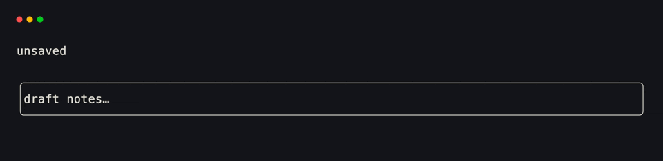
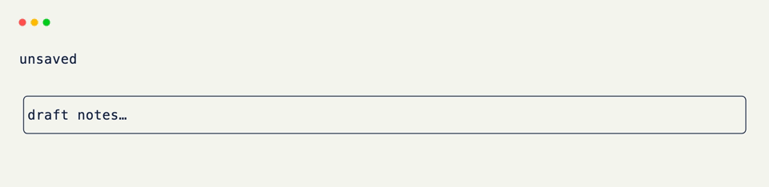

# Action Bindings

`@on_keyboard("ctrl+s")` binds a key directly on one handler. [Action]{data-preview} names that binding once so you can reuse it across handlers, tests, and `perform()` calls.

Events are what the host observed (a key press, a click). Actions are the named intents your app attaches to those inputs — save, quit, next-tab — so the chord and the handler stay decoupled.

## Define an Action

```python title="Define an Action" hl_lines="3 4"
from xnano import Action

SAVE = Action.keyboard("ctrl+s") # (1)!
QUIT = Action.keyboard("q")
```

1. `Action.keyboard(...)` takes the same binding strings as `@on_keyboard` — `"ctrl+s"`, `"q"`, `"enter"`, and so on.

## Bind With `@on_action`

```python title="Bind With @on_action" hl_lines="3 4 5 6"
from xnano import on_action

@on_action(SAVE)
def save(self) -> None: # (1)!
    self.dirty = False
    self.status = "saved"
```

1. `@on_action(SAVE)` fires when that action matches the live event.

## Mix With `@on_keyboard`

One-off keys can stay on [`@on_keyboard`](../api/xnano/events.md#xnano.events.on_keyboard){data-preview}. Use [Action]{data-preview} + [`@on_action`](../api/xnano/events.md#xnano.events.on_action){data-preview} when the same binding is shared, tested, or performed synthetically.

```python title="Mix With @on_keyboard" hl_lines="3 4 5 6"
from xnano import on_keyboard

@on_keyboard("e")
def edit(self) -> None:
    self.dirty = True
    self.status = "unsaved"
```

## A Small Editor

```python title="A Small Editor"
from xnano import (
    Action,
    BaseGrid,
    Context,
    Field,
    Terminal,
    on_action,
    on_keyboard,
)

SAVE = Action.keyboard("ctrl+s")
QUIT = Action.keyboard("q")

class Editor(BaseGrid, direction="vertical", gap=1):
    status: str = Field(default="unsaved", height=1)
    body: str = Field(default="draft notes…", height=3, border="rounded")
    dirty: bool = Field(default=True, state=True)

    @on_action(SAVE)
    def save(self) -> None:
        self.dirty = False
        self.status = "saved"

    @on_action(QUIT)
    def quit(self, ctx: Context) -> None:
        ctx.terminal.request_exit()

    @on_keyboard("e")
    def edit(self) -> None:
        self.dirty = True
        self.status = "unsaved"

Terminal().run(Editor())
```

<div class="xnano-demo" markdown>
{.demo-dark}
{.demo-light}
</div>

## Performing an Action

From tests or another handler, with a live terminal:

```python title="Performing an Action" hl_lines="2"
terminal.perform(SAVE) # (1)!
```

1. `perform` injects the action as if the user had triggered its binding. The same `@on_action(SAVE)` handlers fire.

<br/>

??? abstract "More Action Kinds"

    `Action.keyboard` is the common case. The hierarchy also covers mouse, click, tick, focus, resize, and clipboard — see the [Action]{data-preview} API reference. For the broader hook set, see [events & hooks]{data-preview}.

[Action]: ../api/xnano/core/actions.md
[events & hooks]: ../core-concepts/events.md
