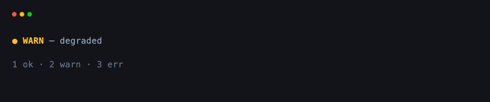
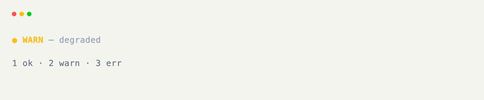

# Composed Text

[Text]{data-preview} covers a single styled span, a line of spans, or a multi-line paragraph. Nested children keep their own colors and modifiers — no ANSI string-building required.

Shape comes from `content` alone: a string is a leaf, a list of leaves is a line, and a list that contains lines becomes a paragraph.

## A Leaf

One run of text with one style.

```python title="A Leaf"
from xnano.components.text import Text

Text("ready", color="emerald-400", modifiers=("bold",))
```

## A Line

A list of leaf children becomes one line, each span independent.

```python title="A Line"
from xnano.components.text import Text

Text([
    Text("● ", color="emerald-400"),
    Text("ok", color="white", modifiers=("bold",)),
    Text(" — all checks passed", color="slate-400"),
])
```

## Rendering a Line

??? example "Interactive Example"

    The following code block is interactive and can be run directly in the browser.

    ```pyodide install="xnano>=1.0.8" hl_lines="4 5 6 7"
    from xnano import render
    from xnano.components.text import Text

    render(Text([
        Text("● ", color="emerald-400"),
        Text("welcome", color="white", modifiers=("bold",)),
        Text(" — xnano is ready", color="slate-400"),
    ]))
    ```

```python title="Rendering a Line" hl_lines="4 5 6 7"
from xnano import render
from xnano.components.text import Text

render(Text([
    Text("● ", color="emerald-400"), # (1)!
    Text("welcome", color="white", modifiers=("bold",)),
    Text(" — xnano is ready", color="slate-400"),
]))
```

1. Each child owns its own `color` and modifiers. The outer [Text]{data-preview} is just the line that holds them.

## A Paragraph

Nest at least one line inside another list and you get a paragraph — each child on its own row.

```python title="A Paragraph"
Text([
    Text([Text("Hello ", color="cyan"), Text("world")]),
    Text("Second line", color="blue"),
])
```

## On a Grid Field

```python title="On a Grid Field" hl_lines="6"
from xnano import BaseGrid, Field
from xnano.components.text import Text

class StatusBar(BaseGrid, direction="vertical"):
    line: Text = Field(
        default_factory=lambda: Text([
            Text("● ", color="emerald-400"),
            Text("ok", color="white", modifiers=("bold",)),
        ]),
        height=1,
    )
```

## Rebuilding When State Changes

Store the level as `state=True` data, rebuild the composed [Text]{data-preview} when it changes, and reassign the field.

```python title="Builder Helper" hl_lines="8 9 10 11 12 13"
_COLORS = {
    "ok": "emerald-400",
    "warn": "amber-400",
    "err": "red-400",
}
_LABELS = {"ok": "healthy", "warn": "degraded", "err": "down"}

def status_line(level: str) -> Text:
    color = _COLORS[level]
    return Text([
        Text("● ", color=color),
        Text(level.upper(), color=color, modifiers=("bold",)),
        Text(f" — {_LABELS[level]}", color="slate-400"),
    ])
```

```python title="Updating From Keys" hl_lines="3 4 5 6 9 10 11 12"
from xnano import on_keyboard

@on_keyboard("1")
def set_ok(self) -> None:
    self.level = "ok"
    self.line = status_line(self.level) # (1)!

@on_keyboard("2")
def set_warn(self) -> None:
    self.level = "warn"
    self.line = status_line(self.level)
```

1. Reassign the whole `Text` when the level changes — same as updating a [Progress]{data-preview} field.

## Putting It Together

```python title="Full Example"
from xnano import BaseGrid, Field, Terminal, Context, on_keyboard
from xnano.components.text import Text

_COLORS = {
    "ok": "emerald-400",
    "warn": "amber-400",
    "err": "red-400",
}
_LABELS = {"ok": "healthy", "warn": "degraded", "err": "down"}

def status_line(level: str) -> Text:
    color = _COLORS[level]
    return Text([
        Text("● ", color=color),
        Text(level.upper(), color=color, modifiers=("bold",)),
        Text(f" — {_LABELS[level]}", color="slate-400"),
    ])

class StatusBar(BaseGrid, direction="vertical", gap=1):
    line: Text = Field(default_factory=lambda: status_line("ok"), height=1)
    hint: str = Field(
        default="1 ok · 2 warn · 3 err · q quit",
        height=1,
        color="slate-500",
    )
    level: str = Field(default="ok", state=True)

    @on_keyboard("1")
    def set_ok(self) -> None:
        self.level = "ok"
        self.line = status_line(self.level)

    @on_keyboard("2")
    def set_warn(self) -> None:
        self.level = "warn"
        self.line = status_line(self.level)

    @on_keyboard("3")
    def set_err(self) -> None:
        self.level = "err"
        self.line = status_line(self.level)

    @on_keyboard("q")
    def quit(self, ctx: Context) -> None:
        ctx.terminal.request_exit()

Terminal().run(StatusBar())
```

<div class="xnano-demo" markdown>
{.demo-dark}
{.demo-light}
</div>

<br/>

For editable inputs (`Text(input=True)`, focus, submit), see [text inputs]{data-preview}.

[Text]: ../components/text.md
[Progress]: ../api/xnano/components/progress.md
[text inputs]: text-inputs.md
