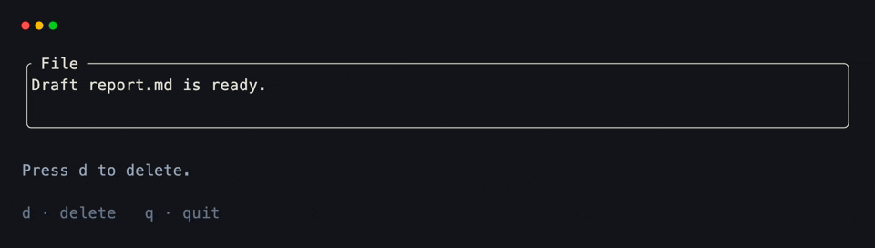
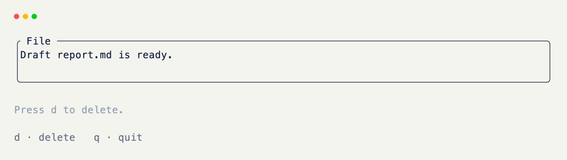

# Confirm Dialogs

A confirm step is a nullable overlay field: `None` means hidden, a [Text]{data-preview} (or string) means shown. Assign the prompt when you need confirmation; set it back to `None` to dismiss.

## Nullable Overlay Field

Fields typed as `T | None` with `default=None` occupy no cells until a value is set. Borders and titles on the field apply when the overlay is present.

```python title="Nullable Overlay Field" hl_lines="8 9 10 11 12"
from xnano import BaseGrid, Field
from xnano.components.text import Text

class Trash(BaseGrid, direction="vertical", gap=1):
    body: str = Field(
        default="Draft report.md is ready.",
        border="rounded",
        title=" File ",
    )
    overlay: Text | None = Field(
        default=None,
        border="rounded",
        title=" Confirm ",
    ) # (1)!
    pending: bool = Field(default=False, state=True)
```

1. Hidden while `None`. `border` and `title` only frame the overlay when a value is assigned.

## Showing the Dialog

Showing the dialog is an assignment. The rest of the grid keeps painting underneath.

```python title="Showing the Dialog" hl_lines="3 4 5 6 7 8 9"
from xnano import on_keyboard

@on_keyboard("d")
def request_delete(self) -> None:
    if self.pending:
        return
    self.pending = True
    self.overlay = Text(
        "Delete draft report.md?\n\n  y · confirm    n / esc · cancel",
        color="amber-200",
    )
```

## Confirm and Cancel

Do the destructive work only on confirm. Open and cancel just toggle the overlay. A `pending` flag keeps `y` / `n` as no-ops when the dialog isn't open.

```python title="Confirm and Cancel" hl_lines="3 4 5 6 7 10 11 12 13 16 17 18 19"
@on_keyboard("y")
def confirm(self) -> None:
    if not self.pending:
        return
    self.body = "(empty — file deleted)"
    self._dismiss()

@on_keyboard("n")
def cancel(self) -> None:
    if not self.pending:
        return
    self._dismiss()

@on_keyboard("esc")
def cancel_escape(self) -> None:
    if not self.pending:
        return
    self._dismiss()

def _dismiss(self) -> None:
    self.pending = False
    self.overlay = None # (1)!
```

1. Dismiss by setting `overlay` back to `None`.

## Putting It Together

```python title="Full Example"
from xnano import BaseGrid, Field, Terminal, Context, on_keyboard
from xnano.components.text import Text

class Trash(BaseGrid, direction="vertical", gap=1):
    body: str = Field(
        default="Draft report.md is ready.",
        border="rounded",
        title=" File ",
    )
    status: str = Field(default="Press d to delete.", height=1, color="slate-400")
    hint: str = Field(default="d · delete   q · quit", height=1, color="slate-500")

    overlay: Text | None = Field(
        default=None,
        border="rounded",
        title=" Confirm ",
    )
    pending: bool = Field(default=False, state=True)

    @on_keyboard("d")
    def request_delete(self) -> None:
        if self.pending:
            return
        self.pending = True
        self.overlay = Text(
            "Delete draft report.md?\n\n  y · confirm    n / esc · cancel",
            color="amber-200",
        )
        self.status = "Waiting for confirmation…"
        self.hint = "y · confirm   n / esc · cancel"

    @on_keyboard("y")
    def confirm(self) -> None:
        if not self.pending:
            return
        self.body = "(empty — file deleted)"
        self.status = "Deleted."
        self._dismiss()

    @on_keyboard("n")
    def cancel(self) -> None:
        if not self.pending:
            return
        self.status = "Delete cancelled."
        self._dismiss()

    @on_keyboard("esc")
    def cancel_escape(self) -> None:
        if not self.pending:
            return
        self.status = "Delete cancelled."
        self._dismiss()

    def _dismiss(self) -> None:
        self.pending = False
        self.overlay = None
        self.hint = "d · delete   q · quit"

    @on_keyboard("q")
    def quit(self, ctx: Context) -> None:
        ctx.terminal.request_exit()

Terminal().run(Trash())
```

<div class="xnano-demo" markdown>
{.demo-dark}
{.demo-light}
</div>

<br/>

??? note "Z-Axis and Overlays"

    Higher-z content paints over lower cells each frame — see the z-axis section in [grids]{data-preview}. A nullable field is the simplest way to mount an overlay.

    For stacked panels that stay mounted (sidebar | main), use nested grids instead — see [nested panels]{data-preview}.

[BaseGrid]: ../api/xnano/grid.md
[Field]: ../api/xnano/fields.md
[Terminal]: ../api/xnano/terminal/terminal.md
[Context]: ../api/xnano/context.md
[Text]: ../api/xnano/components/text.md
[grids]: ../core-concepts/grids.md
[nested panels]: nested-panels.md
