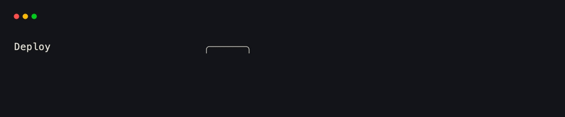
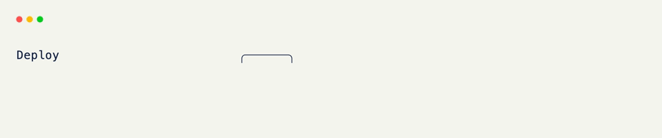

# Custom Components

Subclass [AbstractComponent]{data-preview}, implement `get_size()` and `compose()`, and you get a widget you can drop into a [Field]{data-preview} or pass to [render]{data-preview}. Built-ins follow the same contract.

## The Class Shell

```python title="The Class Shell" hl_lines="6 7 8"
import dataclasses
from xnano.components.abstract import AbstractComponent

@dataclasses.dataclass
class Badge(AbstractComponent):
    text: str = ""
    color: str = "white"
```

## Measure

`get_size()` returns preferred cell size. Skip it and the field's own sizing wins.

```python title="Measure" hl_lines="3 4"
from xnano._types import Size

def get_size(self, ctx):
    return Size(width=len(self.text) + 4, height=3) # (1)!
```

1. Wide enough for the label plus a border, three rows tall for the frame.

## Compose

`compose()` returns host-agnostic content — not a terminal node. Controllers lower that tree into cells or HTML depending on the host.

```python title="Compose" hl_lines="3 4 5 6 7 8"
from xnano.core.content import Panel, TextBlock

def compose(self, ctx):
    return Panel(
        child=TextBlock.from_plain(self.text, color=self.color),
        border="rounded",
    )
```

## Render Standalone

??? example "Interactive Example"

    The following code block is interactive and can be run directly in the browser.

    ```pyodide install="xnano>=1.0.8" hl_lines="5 6 9 10"
    from xnano import render
    from xnano._types import Size
    from xnano.components.abstract import AbstractComponent
    from xnano.core.content import Panel, TextBlock
    import dataclasses

    @dataclasses.dataclass
    class Badge(AbstractComponent):
        text: str = ""
        color: str = "white"

        def get_size(self, ctx):
            return Size(width=len(self.text) + 4, height=3)

        def compose(self, ctx):
            return Panel(
                child=TextBlock.from_plain(self.text, color=self.color),
                border="rounded",
            )

    render(Badge(text="NEW", color="emerald-400"))
    ```

```python title="Render Standalone"
import dataclasses
from xnano import render
from xnano._types import Size
from xnano.components.abstract import AbstractComponent
from xnano.core.content import Panel, TextBlock

@dataclasses.dataclass
class Badge(AbstractComponent):
    text: str = ""
    color: str = "white"

    def get_size(self, ctx):
        return Size(width=len(self.text) + 4, height=3)

    def compose(self, ctx):
        return Panel(
            child=TextBlock.from_plain(self.text, color=self.color),
            border="rounded",
        )

render(Badge(text="NEW", color="emerald-400"))
```

<div class="xnano-demo" markdown>
{.demo-dark}
{.demo-light}
</div>

## As a Field Value

A component is a field value like any other. Use `default_factory` when the instance is mutable or takes constructor arguments.

```python title="As a Field Value" hl_lines="6 7 8"
from xnano import BaseGrid, Field

class Header(BaseGrid, direction="horizontal", gap=1):
    title: str = Field(default="Deploy", height=1)
    badge: Badge = Field(
        default_factory=lambda: Badge(text="LIVE", color="red"), # (1)!
        width="fit",
        height=3,
    )
```

1. Same as putting a `Progress` or `Table` on a field — `default_factory` builds a fresh instance per grid.

<br/>

Reassign the field when the badge should change:

```python title="Updating a Badge"
self.badge = Badge(text="DONE", color="emerald-400")
```

<br/>

Built-ins — [Text]{data-preview}, [Table]{data-preview}, [Progress]{data-preview}, and the rest — are the same shape. See [Components]{data-preview} for the full set.

[AbstractComponent]: ../api/xnano/components/abstract.md
[Field]: ../api/xnano/fields.md
[render]: ../api/xnano/_renderable.md
[Components]: ../components/index.md
[Text]: ../api/xnano/components/text.md
[Table]: ../api/xnano/components/table.md
[Progress]: ../api/xnano/components/progress.md
