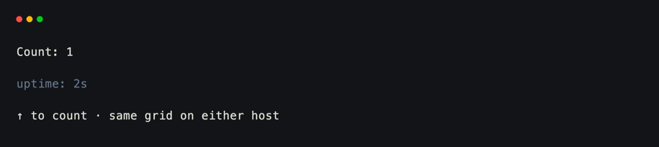
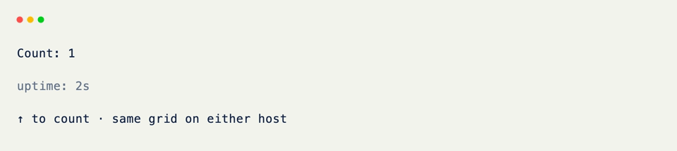

# Dual Host

Hand the same [BaseGrid]{data-preview} class to either [Terminal]{data-preview} or [Web]{data-preview} without changing fields or hooks. Only the entrypoint chooses the host.

## One Grid

Nothing in the class imports `Terminal` or `Web`.

```python title="One Grid" hl_lines="7 8 10 11 12 13 15 16 17"
from xnano import BaseGrid, Field, on_keyboard, on_tick

class Counter(BaseGrid, direction="vertical", gap=1):
    label: str = Field(default="Count: 0", height=1)
    clock: str = Field(default="uptime: 0s", height=1, color="slate-500")
    hint: str = Field(default="↑ to count · works in terminal or browser", height=1)

    count: int = Field(default=0, state=True)
    seconds: int = Field(default=0, state=True)

    @on_keyboard("up")
    def bump(self) -> None:
        self.count += 1
        self.label = f"Count: {self.count}"

    @on_tick(1000)
    def tick(self) -> None:
        self.seconds += 1
        self.clock = f"uptime: {self.seconds}s"
```

<br/>

## Choosing a Host

A thin `main()` reads a flag and constructs one host. Terminal mode runs an instance; web mode can pass the class itself so each browser session gets a fresh grid.

```python title="Choosing a Host" hl_lines="3 6 7 8 11 12"
import sys

def main() -> None:
    use_web = "--web" in sys.argv

    if use_web:
        from xnano.webui import Web

        Web(title="counter").run(Counter) # (1)!
    else:
        from xnano import Terminal

        Terminal().run(Counter())

if __name__ == "__main__":
    main()
```

1. Pass the **class** (`Counter`) for a new grid per browser session. Pass an **instance** (`Counter()`) to share one live grid across every visitor.

<div class="xnano-demo" markdown>
{.demo-dark}
{.demo-light}
</div>

<br/>

```bash title="Run"
uv run python app.py          # terminal
uv run python app.py --web    # http://127.0.0.1:8000
```

??? abstract "Web Dependencies"

    Building HTML/HTMX needs no extra packages, but serving a real process does — install the `web` extra for starlette and uvicorn:

    ```bash
    pip install "xnano[web]"
    ```

??? note "Shared vs. Per-Visitor Sessions"

    ```python
    Web().run(Counter())   # one shared instance for every visitor
    Web().run(Counter)     # a fresh grid per browser session
    ```

    Use the class when each visitor should get their own state. Use an instance when the app is a shared board.

## What Carries Over

Keyboard hooks, ticks, clicks, fields, and components mean the same thing on both hosts. A few [device]{data-preview} and cursor controls only apply in a real terminal and become no-ops on `Web`.

For a fuller sample (text input, click target, and clock together), see `examples/web_counter.py`.

[BaseGrid]: ../api/xnano/grid.md
[Terminal]: ../api/xnano/tui/terminal.md
[Web]: ../api/xnano/webui/web.md
[device]: ../core-concepts/device.md
