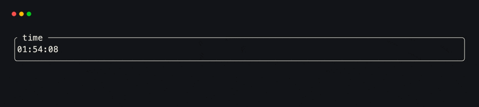
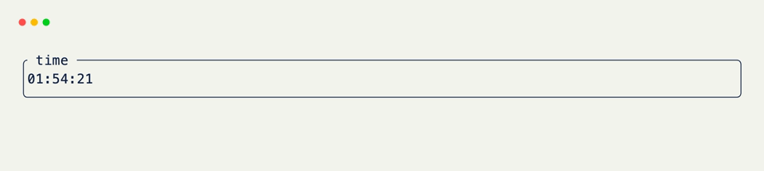

# grid_render

`grid_render()` runs once per frame, before layout, so painted fields can be recomputed from live state. Use it when the display is derived — clocks, tab bodies, headers that read shared state — not when a single key press is enough to rewrite one field.

## Override the Method

Assign field values as usual; do not return a tree.

```python title="Override the Method" hl_lines="8 9"
import time
from xnano import BaseGrid, Field, Terminal

class Clock(BaseGrid, direction="vertical"):
    display: str = Field(default="", height=3, border="rounded", title=" time ")

    def grid_render(self) -> None: # (1)!
        self.display = time.strftime("  %H:%M:%S")

Terminal(tick_interval=200).run(Clock())
```

1. Called every frame after event dispatch and before layout. Initial defaults still come from `Field(default=...)` or `__post_init__`; this method refreshes what changes over time.

<br/>

A short `tick_interval` keeps time-based UIs redrawing. Without ticks, the host still frames on input — clocks need a timer when nothing else is happening.

## Derived From State

When a header depends on app-wide state (or several fields that other hooks mutate), recompute it in `grid_render` instead of repeating the same assignment in every handler.

```python title="Derived From State" hl_lines="14 15 16 17 18 19"
import dataclasses
from xnano import BaseGrid, Context, Field, Terminal, on_keyboard

@dataclasses.dataclass
class AppState:
    username: str = "guest"
    tab: int = 0

class Shell(BaseGrid, direction="vertical", gap=1):
    header: str = Field(
        default="", height=1, color="white", background="violet-900"
    )
    body: str = Field(default="← / → switch tabs · q quit")

    def grid_render(self) -> None:
        state = self.state # (1)!
        tabs = ["Overview", "Config", "Logs"]
        label = tabs[state.tab % len(tabs)]
        self.header = f"  {state.username} · {label}"
        self.body = f"  Active tab: {label}"

    @on_keyboard("left")
    def prev(self, ctx: Context[AppState]) -> None:
        ctx.get_state().tab = (ctx.get_state().tab - 1) % 3

    @on_keyboard("right")
    def next(self, ctx: Context[AppState]) -> None:
        ctx.get_state().tab = (ctx.get_state().tab + 1) % 3

    @on_keyboard("q")
    def quit(self, ctx: Context) -> None:
        ctx.terminal.request_exit()

Terminal(state=AppState(username="hammad")).run(Shell())
```

1. `self.state` is whatever was passed to `Terminal(state=...)`. Reading it here keeps the paint path in one place; hooks only mutate the underlying numbers.

<div class="xnano-demo" markdown>
{.demo-dark}
{.demo-light}
</div>

<br/>

`examples/tabs_nav.py` and `examples/dashboard.py` do the same thing at larger scale: hooks change indices and histories, `grid_render` rebuilds the widgets.

## When Hooks Are Enough

Update fields directly in hooks when a change is event-driven and local — increment a counter, flip a boolean, rewrite one label. Use `grid_render` when:

- Values depend on wall-clock time or external state that moves without a key press.
- Several fields must stay consistent with one shared index (tabs, selected row + detail pane).
- Components are rebuilt as values each frame (`self.table = Services(...)`, sparkline windows, and similar).

Mixing both is normal: hooks mutate state; `grid_render` projects that state onto fields.

[BaseGrid]: ../api/xnano/grid.md
[Context]: ../api/xnano/context.md
