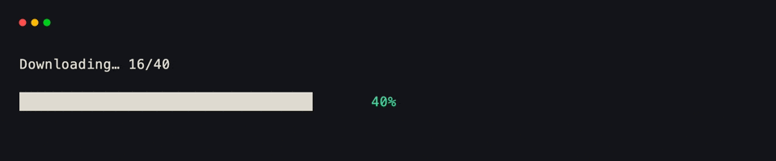
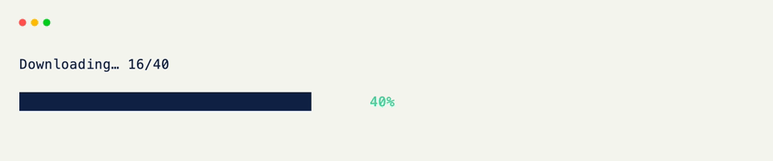

# Live Progress

[Progress]{data-preview} paints a ratio (or value out of a total) as a bar. Update it from `@on_tick` for downloads, tasks, or anything that advances over time.

## Ratio Bar

No `total` means `value` is already the ratio.

??? example "Interactive Example"

    The following code block is interactive and can be run directly in the browser.

    ```pyodide install="xnano>=1.0.8" hl_lines="4"
    from xnano import render
    from xnano.components.progress import Progress

    render(Progress(value=0.6, color="emerald-400"))
    ```

```python title="Ratio Bar" hl_lines="4"
from xnano import render
from xnano.components.progress import Progress

render(Progress(value=0.6, color="emerald-400")) # (1)!
```

1. `0.6` paints as a 60% filled bar labeled `"60%"`.

## Value Over Total

Pass `total` when the raw numbers are more natural than a ratio. The percentage label is still derived unless you set `label` or `label=False`.

```python title="Value Over Total" hl_lines="4"
from xnano import render
from xnano.components.progress import Progress

render(Progress(value=340, total=500, color="sky-400"))
```

## Line Style

`style="line"` is the thinner gauge — same ratio math, different paint.

??? example "Interactive Example"

    The following code block is interactive and can be run directly in the browser.

    ```pyodide install="xnano>=1.0.8" hl_lines="4"
    from xnano import render
    from xnano.components.progress import Progress

    render(Progress(value=0.4, style="line", label="cpu", color="sky-400"))
    ```

```python title="Line Style" hl_lines="4"
from xnano import render
from xnano.components.progress import Progress

render(Progress(value=0.4, style="line", label="cpu", color="sky-400"))
```

## On a Grid Field

Use `default_factory` — [Progress]{data-preview} is a component instance, not a plain immutable default.

```python title="On a Grid Field" hl_lines="5 6"
from xnano import BaseGrid, Field
from xnano.components.progress import Progress

class Download(BaseGrid, direction="vertical", gap=1):
    bar: Progress = Field(
        default_factory=lambda: Progress(value=0.0, color="emerald-400"),
        height=1,
    )
```

## Advancing From a Tick

Keep raw counters as `state=True` fields. Rebuild a fresh [Progress]{data-preview} each tick and reassign the field.

```python title="Advancing From a Tick" hl_lines="12 13 14 15 16 17"
from xnano import on_tick
from xnano.components.progress import Progress

@on_tick(80) # (1)!
def advance(self) -> None:
    if self.paused or self.done >= self.total:
        return
    self.done += 1
    ratio = self.done / self.total
    self.bar = Progress(value=ratio, color="emerald-400") # (2)!
    self.status = (
        "Done." if self.done >= self.total
        else f"Downloading… {self.done}/{self.total}"
    )
```

1. `@on_tick(80)` fires every 80ms. A bare `@on_tick` fires every frame.
2. Reassign a new [Progress]{data-preview} each update. The field paints whatever instance it currently holds.

## Pause Toggle

```python title="Pause Toggle" hl_lines="3 4 5 6"
from xnano import on_keyboard

@on_keyboard("space")
def toggle(self) -> None:
    self.paused = not self.paused
    if self.done < self.total:
        self.status = "Paused." if self.paused else "Downloading…"
```

## Putting It Together

```python title="Full Example"
from xnano import BaseGrid, Field, Terminal, Context, on_keyboard, on_tick
from xnano.components.progress import Progress

class Download(BaseGrid, direction="vertical", gap=1):
    status: str = Field(default="Downloading…", height=1)
    bar: Progress = Field(
        default_factory=lambda: Progress(value=0.0, color="emerald-400"),
        height=1,
    )
    gauge: Progress = Field(
        default_factory=lambda: Progress(
            value=0.0, style="line", label="bytes", color="sky-400"
        ),
        height=1,
    )
    done: int = Field(default=0, state=True)
    total: int = Field(default=100, state=True)
    paused: bool = Field(default=False, state=True)

    @on_tick(80)
    def advance(self) -> None:
        if self.paused or self.done >= self.total:
            return
        self.done += 1
        ratio = self.done / self.total
        self.bar = Progress(value=ratio, color="emerald-400")
        self.gauge = Progress(
            value=self.done,
            total=self.total,
            style="line",
            label="bytes",
            color="sky-400",
        )
        self.status = (
            "Done." if self.done >= self.total
            else f"Downloading… {self.done}/{self.total}"
        )

    @on_keyboard("space")
    def toggle(self) -> None:
        self.paused = not self.paused
        if self.done < self.total:
            self.status = "Paused." if self.paused else "Downloading…"

    @on_keyboard("q")
    def quit(self, ctx: Context) -> None:
        ctx.terminal.request_exit()

Terminal().run(Download())
```

<div class="xnano-demo" markdown>
{.demo-dark}
{.demo-light}
</div>

<br/>

Full parameters: [Progress]{data-preview}. Tick and keyboard hooks: [events & hooks]{data-preview}.

[Progress]: ../api/xnano/components/progress.md
[events & hooks]: ../core-concepts/events.md
