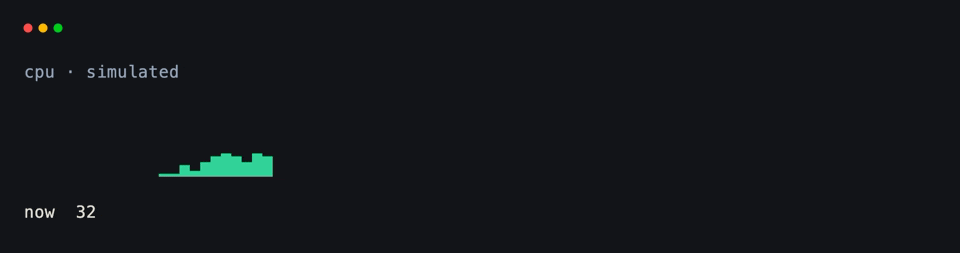
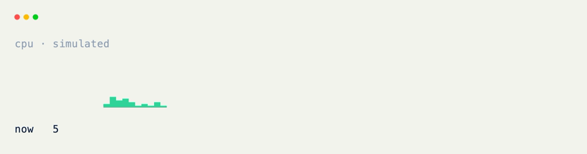

# Live Sparklines

[Sparkline]{data-preview} paints a sequence of samples as a compact inline chart. Keep a rolling history in state, append on `@on_tick`, trim to a fixed window, and reassign the field.

## A Static Sparkline

Bar heights scale to the tallest sample unless you set `max_value`.

??? example "Interactive Example"

    The following code block is interactive and can be run directly in the browser.

    ```pyodide install="xnano>=1.0.8" hl_lines="4"
    from xnano import Terminal
    from xnano.components.sparkline import Sparkline

    Terminal(height=4).render(
        Sparkline(data=[1, 4, 2, 8, 5, 9, 3, 7], color="sky-400")
    )
    ```

```python title="A Static Sparkline" hl_lines="4"
from xnano import Terminal
from xnano.components.sparkline import Sparkline

Terminal(height=4).render(
    Sparkline(data=[1, 4, 2, 8, 5, 9, 3, 7], color="sky-400")
) # (1)!
```

1. Pass `max_value` when auto-scaling would make quiet series look noisy — or when comparing several sparklines side by side.

## On a Grid Field

```python title="On a Grid Field" hl_lines="6 7 8 9"
from xnano import BaseGrid, Field
from xnano.components.sparkline import Sparkline

class MetricStrip(BaseGrid, direction="vertical", gap=1):
    chart: Sparkline = Field(
        default_factory=lambda: Sparkline(
            data=[0] * 24, max_value=100, color="emerald-400"
        ),
        height=4,
    )
```

## History in State

The list never paints on its own — `state=True` holds history; `chart` is the painted field.

```python title="History in State" hl_lines="2"
samples: list[int] = Field(
    default_factory=lambda: [0] * 24, state=True
)
```

## Append on Tick

Each tick appends a sample, trims the window, and rebuilds the sparkline.

```python title="Append on Tick" hl_lines="3 4 5 6 7 8 9 10 11"
import random
from xnano import on_tick
from xnano.components.sparkline import Sparkline

_HISTORY = 24

@on_tick(120)
def sample(self) -> None:
    next_value = max(0, min(100, self.samples[-1] + random.randint(-12, 14)))
    self.samples.append(next_value)
    if len(self.samples) > _HISTORY:
        self.samples = self.samples[-_HISTORY:] # (1)!
    self.chart = Sparkline(
        data=list(self.samples),
        max_value=100,
        color="emerald-400",
    )
    self.readout = f"now {next_value:>3}"
```

1. Trim after append so the window stays fixed. Reassign a new [Sparkline]{data-preview} each tick rather than mutating the previous instance in place.

## Putting It Together

```python title="Full Example"
import random
from xnano import BaseGrid, Field, Terminal, Context, on_keyboard, on_tick
from xnano.components.sparkline import Sparkline

_HISTORY = 24

class MetricStrip(BaseGrid, direction="vertical", gap=1):
    heading: str = Field(default="cpu · simulated", height=1, color="slate-400")
    chart: Sparkline = Field(
        default_factory=lambda: Sparkline(
            data=[0] * _HISTORY, max_value=100, color="emerald-400"
        ),
        height=4,
    )
    readout: str = Field(default="—", height=1)
    samples: list[int] = Field(
        default_factory=lambda: [0] * _HISTORY, state=True
    )

    @on_tick(120)
    def sample(self) -> None:
        next_value = max(
            0, min(100, self.samples[-1] + random.randint(-12, 14))
        )
        self.samples.append(next_value)
        if len(self.samples) > _HISTORY:
            self.samples = self.samples[-_HISTORY:]
        self.chart = Sparkline(
            data=list(self.samples),
            max_value=100,
            color="emerald-400",
        )
        self.readout = (
            f"now {next_value:>3}  "
            f"avg {sum(self.samples) // len(self.samples):>3}"
        )

    @on_keyboard("q")
    def quit(self, ctx: Context) -> None:
        ctx.terminal.request_exit()

Terminal().run(MetricStrip())
```

<div class="xnano-demo" markdown>
{.demo-dark}
{.demo-light}
</div>

<br/>

Optional `colors=` takes one color per sample for a gradient across the window — see [Sparkline]{data-preview}. `examples/dashboard.py` and `examples/feed.py` combine sparklines with tables and gauges.

[Sparkline]: ../api/xnano/components/sparkline.md
[BaseGrid]: ../api/xnano/grid.md
