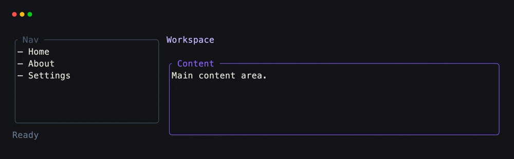
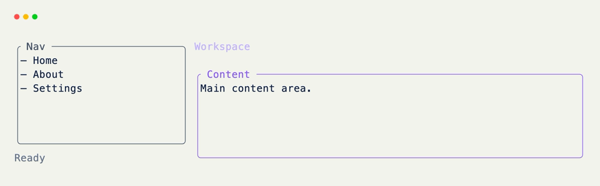

# Nested Panels

Nest grids by putting child [BaseGrid]{data-preview} instances on parent fields with `default_factory`. Each child keeps its own fields, sizing, and hooks.

## Child Grids

Define regions as their own grid classes first.

```python title="Child Grids"
from xnano import BaseGrid, Field

class Sidebar(BaseGrid, direction="vertical"):
    nav: str = Field(
        default="  — Home\n  — About\n  — Settings",
        border="rounded",
        border_color="slate-600",
        title=" Nav ",
    )
    status: str = Field(default="  Ready", height=1, color="slate-500")

class Main(BaseGrid, direction="vertical", gap=1):
    title: str = Field(default="  Workspace", height=1, color="violet-300")
    body: str = Field(
        default="Main content area.",
        border="rounded",
        border_color="violet-500",
        title=" Content ",
    )
```

## Parent Layout

A nested grid is still a field value. It occupies a slot on the parent the same way a string would — the content of that slot is a full sub-layout.

```python title="Parent Layout" hl_lines="2 3"
class App(BaseGrid, direction="horizontal", gap=1):
    sidebar: Sidebar = Field(default_factory=Sidebar, width="25%") # (1)!
    main: Main = Field(default_factory=Main, width="1fr")
```

1. `default_factory=Sidebar` builds a fresh child per parent instance. `width="25%"` sizes the child's slot; the child's own fields lay out inside it.

<br/>

??? example "Interactive Example"

    The following code block is interactive and can be run directly in the browser.

    ```pyodide install="xnano>=1.0.8" hl_lines="14 15"
    from xnano import BaseGrid, Field, Terminal

    class Sidebar(BaseGrid, direction="vertical"):
        nav: str = Field(
            default="  — Home\n  — About\n  — Settings",
            border="rounded",
            border_color="slate-600",
            title=" Nav ",
        )
        status: str = Field(default="  Ready", height=1, color="slate-500")

    class Main(BaseGrid, direction="vertical", gap=1):
        title: str = Field(default="  Workspace", height=1, color="violet-300")
        body: str = Field(
            default="Main content area.",
            border="rounded",
            border_color="violet-500",
            title=" Content ",
        )

    class App(BaseGrid, direction="horizontal", gap=1):
        sidebar: Sidebar = Field(default_factory=Sidebar, width="25%")
        main: Main = Field(default_factory=Main, width="1fr")

    Terminal(height=10).render(App())
    ```

## Parent Hooks

Parent hooks can reach into children by attribute. Child classes can declare their own `@on_*` hooks too.

```python title="Parent Hooks" hl_lines="4 5 9 10"
from xnano import Context, on_keyboard

@on_keyboard("1")
def show_home(self) -> None:
    self.main.body = "Home — overview of the workspace."
    self.sidebar.status = "  Home"

@on_keyboard("2")
def show_about(self) -> None:
    self.main.body = "About — what this panel stack is for."
    self.sidebar.status = "  About"

@on_keyboard("q")
def quit(self, ctx: Context) -> None:
    ctx.terminal.request_exit()
```

## Putting It Together

```python title="Full Example"
from xnano import BaseGrid, Field, Terminal, Context, on_keyboard

class Sidebar(BaseGrid, direction="vertical"):
    nav: str = Field(
        default="  — Home\n  — About\n  — Settings",
        border="rounded",
        border_color="slate-600",
        title=" Nav ",
    )
    status: str = Field(default="  Ready", height=1, color="slate-500")

class Main(BaseGrid, direction="vertical", gap=1):
    title: str = Field(default="  Workspace", height=1, color="violet-300")
    body: str = Field(
        default="Main content area.\nNested grids keep layout regions separate.",
        border="rounded",
        border_color="violet-500",
        title=" Content ",
    )

class App(BaseGrid, direction="horizontal", gap=1):
    sidebar: Sidebar = Field(default_factory=Sidebar, width="25%")
    main: Main = Field(default_factory=Main, width="1fr")

    @on_keyboard("1")
    def show_home(self) -> None:
        self.main.body = "Home — overview of the workspace."
        self.sidebar.status = "  Home"

    @on_keyboard("2")
    def show_about(self) -> None:
        self.main.body = "About — what this panel stack is for."
        self.sidebar.status = "  About"

    @on_keyboard("3")
    def show_settings(self) -> None:
        self.main.body = "Settings — theme, density, and keys."
        self.sidebar.status = "  Settings"

    @on_keyboard("q")
    def quit(self, ctx: Context) -> None:
        ctx.terminal.request_exit()

Terminal().run(App())
```

<div class="xnano-demo" markdown>
{.demo-dark}
{.demo-light}
</div>

<br/>

??? abstract "Composition Notes"

    - Use nested [BaseGrid]{data-preview} subclasses for stable regions; use plain strings or components when a slot is just content.
    - Sizing on the parent (`width`, `height`, `fr`, `%`) controls the child's outer slot.
    - Deeper trees (header + body + footer) are the same idea stacked.
    - Overlays and confirms: [confirm dialogs]{data-preview}.

[BaseGrid]: ../api/xnano/grid.md
[Field]: ../api/xnano/fields.md
[Terminal]: ../api/xnano/tui/terminal.md
[Context]: ../api/xnano/context.md
[Text]: ../api/xnano/components/text.md
[confirm dialogs]: confirm-dialog.md
