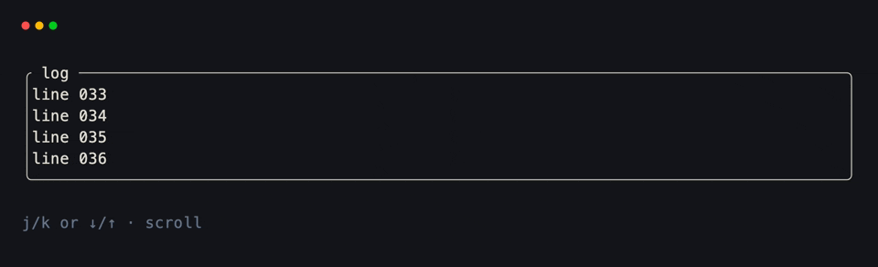
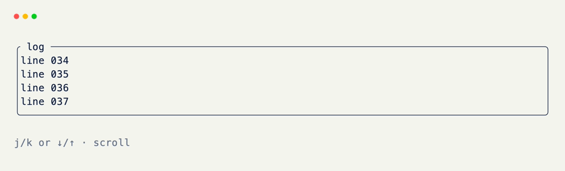

# Scrollable Logs

Keep a longer buffer in state and paint only a window of lines. Keyboard handlers move a `scroll_offset`; new lines can stick to the bottom when the view is already at the end.

Useful for build output, tool traces, and any feed that outgrows the terminal height.

## Buffer and Window

Store every line in a list. Derive the visible window from `scroll_offset` and a fixed viewport height. Only the joined window becomes a field value.

```python title="Buffer and Window" hl_lines="8 9 11 12 13 14 15 16"
from xnano import BaseGrid, Field

VIEW_HEIGHT = 8

class LogView(BaseGrid, direction="vertical", gap=1):
    body: str = Field(default="", border="rounded", title=" log ")
    hint: str = Field(default="j/k or ↓/↑ to scroll", height=1, color="slate-500")

    buffer: list[str] = Field(default_factory=list, state=True)
    scroll_offset: int = Field(default=0, state=True) # (1)!

    def _window(self) -> list[str]:
        start = self.scroll_offset
        return self.buffer[start : start + VIEW_HEIGHT]

    def _paint(self) -> None:
        lines = self._window()
        self.body = "\n".join(lines) if lines else "  (empty)"
```

1. `scroll_offset` is the index of the first visible line. It never paints; only `body` does.

<br/>

Clamp the offset whenever the buffer shrinks or the window would slide past the end: `max(0, min(scroll_offset, max(0, len(buffer) - VIEW_HEIGHT)))`.

## Keyboard Scroll

Bind up/down (or `j`/`k`) to nudge the offset one line at a time, then repaint. Pass multiple keys to one decorator.

```python title="Keyboard Scroll" hl_lines="3 4 5 6 8 9 10 11"
from xnano import on_keyboard

@on_keyboard("up", "k") # (1)!
def scroll_up(self) -> None:
    self.scroll_offset = max(0, self.scroll_offset - 1)
    self._paint()

@on_keyboard("down", "j")
def scroll_down(self) -> None:
    max_offset = max(0, len(self.buffer) - VIEW_HEIGHT)
    self.scroll_offset = min(max_offset, self.scroll_offset + 1)
    self._paint()
```

1. Extra positional keys are OR'd into the same filter — arrow up and `k` both call `scroll_up`.

## Append and Auto-Follow

When new lines arrive, decide whether the view should stay pinned to the bottom. If the user had scrolled up, leave their place alone.

```python title="Append and Auto-Follow" hl_lines="3 4 5 6 7 8 9 10"
def append_line(self, line: str) -> None:
    max_offset_before = max(0, len(self.buffer) - VIEW_HEIGHT)
    at_bottom = self.scroll_offset >= max_offset_before # (1)!

    self.buffer.append(line)

    if at_bottom:
        self.scroll_offset = max(0, len(self.buffer) - VIEW_HEIGHT)
    self._paint()
```

1. Capture "were we following the tail?" *before* mutating the buffer. After append, only stick to the end if that was already true.

<br/>

A minimal live demo seeds the buffer and scrolls with the keyboard:

```python title="Full Example" hl_lines="14 15 16 17 18 19 20 21 22 23 24 25 26 27 28 29 30"
from xnano import BaseGrid, Field, Terminal, Context, on_keyboard

VIEW_HEIGHT = 8

class LogView(BaseGrid, direction="vertical", gap=1):
    body: str = Field(default="", border="rounded", title=" log ")
    hint: str = Field(default="j/k or ↓/↑ · q quits", height=1, color="slate-500")

    buffer: list[str] = Field(default_factory=list, state=True)
    scroll_offset: int = Field(default=0, state=True)

    def __post_init__(self) -> None:
        self.buffer = [f"line {i:03d}" for i in range(40)]
        self.scroll_offset = max(0, len(self.buffer) - VIEW_HEIGHT)
        self._paint()

    def _paint(self) -> None:
        start = self.scroll_offset
        self.body = "\n".join(self.buffer[start : start + VIEW_HEIGHT])

    @on_keyboard("up", "k")
    def scroll_up(self) -> None:
        self.scroll_offset = max(0, self.scroll_offset - 1)
        self._paint()

    @on_keyboard("down", "j")
    def scroll_down(self) -> None:
        max_offset = max(0, len(self.buffer) - VIEW_HEIGHT)
        self.scroll_offset = min(max_offset, self.scroll_offset + 1)
        self._paint()

    @on_keyboard("q")
    def quit(self, ctx: Context) -> None:
        ctx.terminal.request_exit()

Terminal().run(LogView())
```

<div class="xnano-demo" markdown>
{.demo-dark}
{.demo-light}
</div>

<br/>

For token streams, call `append_line` (or append many lines and paint once) from `@on_tick` or your producer hook. Keep the full history in `buffer`; only the window is assigned to the field.

[BaseGrid]: ../api/xnano/grid.md
