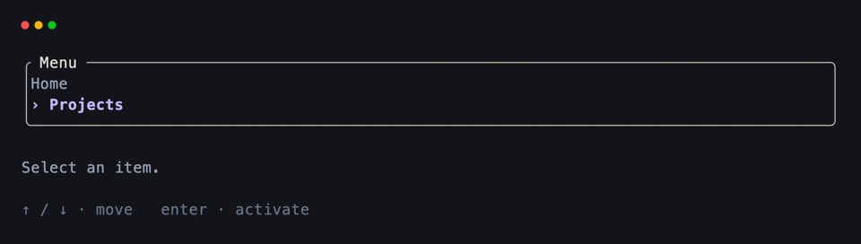
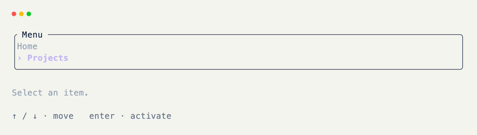

# Selection Lists

A selection list is items plus an index in state, a painted body with a highlight on the active row, and keyboard hooks that move the index or act on the choice. There is no separate list widget.

## Items and Index

Start with the data only — nothing painted yet.

```python title="Items and Index" hl_lines="8 9"
from xnano import BaseGrid, Field
from xnano.components.text import Text

ITEMS = ["Home", "Projects", "Settings", "About"]

class Menu(BaseGrid, direction="vertical", gap=1):
    body: Text = Field(default=Text(""), border="rounded", title=" Menu ")
    status: str = Field(default="Select an item.", height=1, color="slate-400")

    items: list = Field(default_factory=lambda: list(ITEMS), state=True)
    selected: int = Field(default=0, state=True) # (1)!
```

1. `selected` is pure state — never painted on its own.

## Painting Rows

Derive the body from `items` + `selected`. Rebuild whenever either changes.

```python title="Painting Rows" hl_lines="1 2 3 4 5 6 7 8 9 10 11 12"
def _paint(self) -> None:
    rows: list[Text] = []
    for index, item in enumerate(self.items):
        if index == self.selected:
            rows.append(
                Text([Text(f" › {item}", color="violet-300", modifiers=("bold",))])
            ) # (1)!
        else:
            rows.append(Text([Text(f"   {item}", color="slate-400")]))
    self.body = Text(rows)

def __post_init__(self) -> None:
    self._paint()
```

1. The highlight is just different text (and style) on the selected row. Plain strings work if you don't need per-row color.

## Moving the Selection

```python title="Moving the Selection" hl_lines="3 4 5 8 9 10"
from xnano import on_keyboard

@on_keyboard("up")
def move_up(self) -> None:
    self.selected = (self.selected - 1) % len(self.items)
    self._paint()

@on_keyboard("down")
def move_down(self) -> None:
    self.selected = (self.selected + 1) % len(self.items)
    self._paint()
```

## Activating a Row

```python title="Activating a Row" hl_lines="3 4 5"
@on_keyboard("enter")
def activate(self) -> None:
    self.status = f"Opened: {self.items[self.selected]}" # (1)!
```

1. Activation can set a status line, swap a panel, or anything else — the list only needs to expose the chosen value.

## Putting It Together

```python title="Full Example"
from xnano import BaseGrid, Field, Terminal, Context, on_keyboard
from xnano.components.text import Text

ITEMS = ["Home", "Projects", "Settings", "About"]

class Menu(BaseGrid, direction="vertical", gap=1):
    body: Text = Field(default=Text(""), border="rounded", title=" Menu ")
    status: str = Field(default="Select an item.", height=1, color="slate-400")
    hint: str = Field(
        default="↑ / ↓ · move   enter · activate   q · quit",
        height=1,
        color="slate-500",
    )

    items: list = Field(default_factory=lambda: list(ITEMS), state=True)
    selected: int = Field(default=0, state=True)

    def _paint(self) -> None:
        rows: list[Text] = []
        for index, item in enumerate(self.items):
            if index == self.selected:
                rows.append(
                    Text([Text(f" › {item}", color="violet-300", modifiers=("bold",))])
                )
            else:
                rows.append(Text([Text(f"   {item}", color="slate-400")]))
        self.body = Text(rows)

    def __post_init__(self) -> None:
        self._paint()

    @on_keyboard("up")
    def move_up(self) -> None:
        self.selected = (self.selected - 1) % len(self.items)
        self._paint()

    @on_keyboard("down")
    def move_down(self) -> None:
        self.selected = (self.selected + 1) % len(self.items)
        self._paint()

    @on_keyboard("enter")
    def activate(self) -> None:
        self.status = f"Opened: {self.items[self.selected]}"

    @on_keyboard("q")
    def quit(self, ctx: Context) -> None:
        ctx.terminal.request_exit()

Terminal().run(Menu())
```

<div class="xnano-demo" markdown>
{.demo-dark}
{.demo-light}
</div>

<br/>

To change the list later, assign a new one (`self.items = [*self.items, "New"]`) and call `_paint()` again. For long buffers that need scrolling, see [scrollable logs]{data-preview}.

[BaseGrid]: ../api/xnano/grid.md
[Field]: ../api/xnano/fields.md
[Terminal]: ../api/xnano/tui/terminal.md
[Context]: ../api/xnano/context.md
[Text]: ../api/xnano/components/text.md
[scrollable logs]: scrollable-log.md
