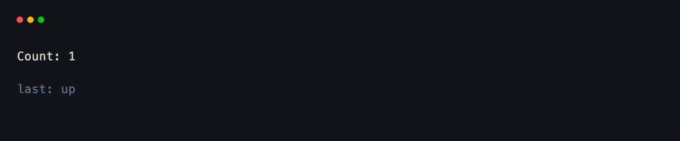
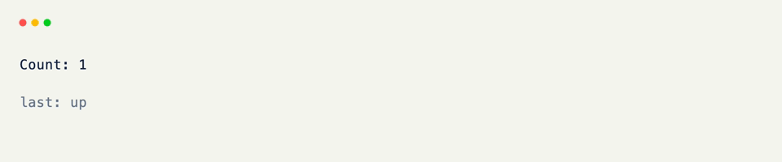

# Shared State

Pass an object to [`Terminal(state=...)`](../api/xnano/terminal/terminal.md#xnano.terminal.terminal.Terminal){data-preview} and every hook can read and write it through [Context]{data-preview}. Multiple grids and handlers share one instance for the life of the session.

A dataclass, a Pydantic model, or xnano's own `State` all work. Parameterize `Context[AppState]` so `ctx.get_state()` returns a typed object instead of `Any` — same idea as [typing Context by state]{data-preview}.

## Attaching State to the Terminal

Define a schema, construct it once, and hand it to [Terminal]{data-preview}.

```python title="Attaching State" hl_lines="14 15 33"
import dataclasses
from xnano import BaseGrid, Field, Terminal, Context, on_keyboard

@dataclasses.dataclass
class AppState:
    count: int = 0
    last_key: str = ""

class Counter(BaseGrid, direction="vertical", gap=1):
    label: str = Field(default="Count: 0", height=1)
    meta: str = Field(default="last: —", height=1, color="slate-500")

    @on_keyboard("up")
    def inc(self, ctx: Context[AppState]) -> None: # (1)!
        state = ctx.get_state() # (2)!
        state.count += 1
        state.last_key = "up"
        self.label = f"Count: {state.count}"
        self.meta = f"last: {state.last_key}"

    @on_keyboard("down")
    def dec(self, ctx: Context[AppState]) -> None:
        state = ctx.get_state()
        state.count -= 1
        state.last_key = "down"
        self.label = f"Count: {state.count}"
        self.meta = f"last: {state.last_key}"

    @on_keyboard("q")
    def quit(self, ctx: Context) -> None:
        ctx.terminal.request_exit()

Terminal(state=AppState()).run(Counter()) # (3)!
```

1. `Context[AppState]` is a typing-only generic — runtime is unchanged, but `get_state()` is no longer `Any`.
2. `ctx.get_state()` raises if no `state=` was attached to the terminal. Use a `state=True` field when the value only needs to live on one grid.
3. The same `AppState()` instance is shared by every hook for the life of this session.

<div class="xnano-demo" markdown>
{.demo-dark}
{.demo-light}
</div>

<br/>

Both handlers mutate the same object — shared counters, selection, auth, and similar belong on the terminal, not copied onto every grid.

## Shared State vs. Field State

Not every value needs to cross the whole app.

| | Lives on | Good for |
|---|---|---|
| `Terminal(state=...)` | the host session | data many handlers or grids share |
| `Field(..., state=True)` | one grid instance | local UI state that never leaves that grid |

Local toggles, scroll offsets, and per-panel counters usually stay as `state=True` fields — see [fields]{data-preview} and [events & hooks]{data-preview}. Use terminal state when a second grid or a later screen needs the same object.

??? note "Plain Dataclass Is Enough"

    Nothing above requires xnano's `State` helper. A dataclass or Pydantic model works the same way. `State` is a convenience when you don't want a fixed schema up front — covered on the [Context]{data-preview} page.

<br/>

To update the window title or clipboard from the same state, see [title & clipboard]{data-preview} — `ctx.device` and `ctx.get_state()` sit on the same [Context]{data-preview}.

[Context]: ../api/xnano/context.md
[Terminal]: ../api/xnano/terminal/terminal.md
[typing Context by state]: ../core-concepts/context.md
[fields]: ../core-concepts/fields.md
[events & hooks]: ../core-concepts/events.md
[title & clipboard]: title-and-clipboard.md
