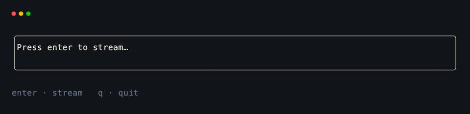
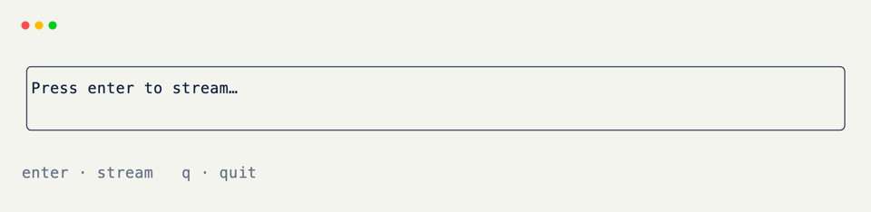

# Streaming Content

Two ways to stream text with xnano: update a field inside a live grid on each tick, or call `render()` the way you'd call `print` — including append and in-place replace.

## Live Grid

Buffer chunks into a `state=True` list, then append one chunk to a painted field on every `@on_tick`. A live generator can't live on the grid; a concrete list can.

```python title="Live Grid" hl_lines="14 15 22 23 24 25"
from xnano import BaseGrid, Field, Terminal, Context, on_keyboard, on_tick

class Stream(BaseGrid, direction="vertical", gap=1):
    body: str = Field(default="Press enter to stream…", border="rounded")
    hint: str = Field(default="enter · stream   q · quit", height=1, color="slate-500")

    chunks: list = Field(default_factory=list, state=True)
    index: int = Field(default=0, state=True)

    @on_keyboard("enter")
    def begin(self) -> None:
        words = "Streaming is ticks writing into a field, one chunk at a time.".split()
        self.chunks = [w if i == len(words) - 1 else w + " " for i, w in enumerate(words)]
        self.index = 0
        self.body = "" # (1)!

    @on_tick(40)
    def advance(self) -> None:
        if self.index >= len(self.chunks):
            return
        self.body = self.body + self.chunks[self.index] # (2)!
        self.index += 1

    @on_keyboard("q")
    def quit(self, ctx: Context) -> None:
        ctx.terminal.request_exit()

Terminal().run(Stream())
```

1. Start empty, with the source already drained into `chunks`.
2. Each tick appends the next delta and reassigns the field so the frame repaints.

<div class="xnano-demo" markdown>
{.demo-dark}
{.demo-light}
</div>

<br/>

If each item from your source is already the *full* string so far (not a bare token), assign that snapshot instead of appending:

```python title="Full Snapshots"
@on_tick(40)
def advance(self) -> None:
    if self.index >= len(self.chunks):
        return
    self.body = self.chunks[self.index] # (1)!
    self.index += 1
```

1. Use this when the producer sends cumulative text. Appending those would double content.

## `render()` Like `print`

Outside a grid session, `render()` is a drop-in for `print` — same `sep` / `end` / `flush`, plus `stream=` for a tracked region that can append or replace in place.

### Append Chunks

```python title="Append Chunks" hl_lines="3 4"
from xnano import render

render("Hello", stream="chat", end="", flush=True) # (1)!
render(" world", stream="chat", end="\n", flush=True)
```

1. `stream="chat"` names a region. Without `update=True`, each call **appends** to that region (token-by-token style).

<br/>

### Replace the Region

```python title="Replace the Region" hl_lines="3 4"
from xnano import render

render("Loading…", stream="status", update=True, end="\n") # (1)!
render("Done!", stream="status", update=True, end="\n")
```

1. `update=True` **replaces** the whole region — rewinds the previous lines and paints the new content. Useful when each event already has the full string so far.

<br/>

`stream=True` is the same as `stream="default"`. Styling kwargs (`color=`, `border=`, …) still apply to each `render()` call the same way they do for a one-shot print.

??? note "Grid vs. `render()`"

    Use the live grid when the stream is one field among hooks, layout, and other UI. Use `render(..., stream=...)` when you want print-like stdout (or a named stream region) without a `Terminal().run(...)` app.

[BaseGrid]: ../api/xnano/grid.md
[Field]: ../api/xnano/fields.md
[Terminal]: ../api/xnano/tui/terminal.md
[Context]: ../api/xnano/context.md
[render]: ../api/xnano/_renderable.md
