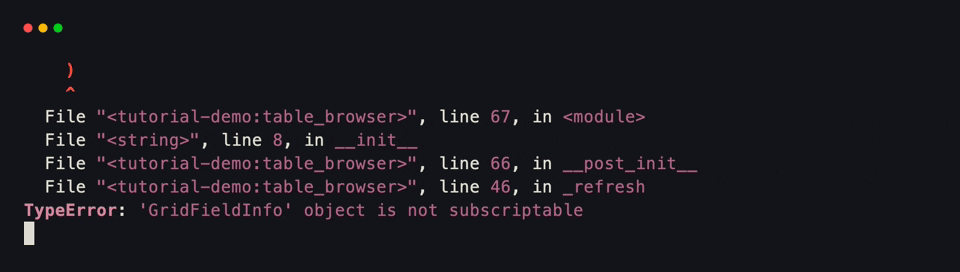
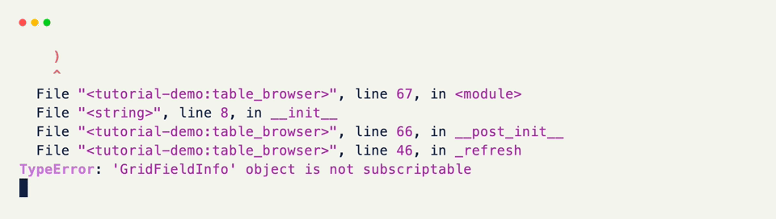

# Table Browser

Drive a [Table]{data-preview}'s `selected` row from keyboard state, and mirror the active row on a status line. Rows are plain data; rebuild the table whenever the selection moves.

## A Declarative Table

Subclass [Table]{data-preview} with `Column` descriptors when the schema is fixed.

??? example "Interactive Example"

    The following code block is interactive and can be run directly in the browser.

    ```pyodide install="xnano>=1.0.8" hl_lines="4 5 6 7 8 9 10"
    from xnano import render
    from xnano.components.table import Column, Table

    class Services(Table):
        service: str = Column()
        status: str = Column(color=lambda v: "green" if v == "ok" else "red")
        latency: int = Column(align="right", format="{}ms")

    render(Services(data=[
        {"service": "api", "status": "ok", "latency": 12},
        {"service": "db", "status": "degraded", "latency": 340},
        {"service": "cache", "status": "ok", "latency": 4},
    ], selected=0))
    ```

```python title="A Declarative Table" hl_lines="4 5 6 7 8 9 10"
from xnano import render
from xnano.components.table import Column, Table

class Services(Table):
    service: str = Column()
    status: str = Column(color=lambda v: "green" if v == "ok" else "red")
    latency: int = Column(align="right", format="{}ms")

render(Services(data=[
    {"service": "api", "status": "ok", "latency": 12},
    {"service": "db", "status": "degraded", "latency": 340},
    {"service": "cache", "status": "ok", "latency": 4},
], selected=0)) # (1)!
```

1. `selected=0` highlights the first row. The table keeps that row in view as the list grows.

<br/>

For one-off tables, skip the subclass and pass `columns=` as a mapping of name to header text or a full `Column`.

## Keyboard Selection

Store the rows and index as `state=True` fields. On up/down, clamp the index and reassign the table with a fresh `Services(..., selected=index)`.

```python title="Keyboard Selection" hl_lines="18 19 20 22 23 24 25 27 28 29 30"
from xnano import BaseGrid, Field, Terminal, Context, on_keyboard
from xnano.components.table import Column, Table

class Services(Table):
    service: str = Column()
    status: str = Column(color=lambda v: "green" if v == "ok" else "red")
    latency: int = Column(align="right", format="{}ms")

ROWS = [
    {"service": "api", "status": "ok", "latency": 12},
    {"service": "db", "status": "degraded", "latency": 340},
    {"service": "cache", "status": "ok", "latency": 4},
]

class Browser(BaseGrid, direction="vertical", gap=1):
    table: Services = Field(
        default_factory=lambda: Services(data=ROWS, selected=0),
    )
    status: str = Field(default="", height=1, color="slate-400")
    hint: str = Field(default="↑ / ↓ · select   q · quit", height=1, color="slate-500")

    rows: list = Field(default_factory=lambda: list(ROWS), state=True)
    index: int = Field(default=0, state=True)

    def _refresh(self) -> None:
        self.table = Services(data=self.rows, selected=self.index) # (1)!
        row = self.rows[self.index]
        self.status = f"  {row['service']}: {row['status']} · {row['latency']}ms"

    @on_keyboard("up")
    def previous(self) -> None:
        self.index = max(0, self.index - 1)
        self._refresh()

    @on_keyboard("down")
    def next(self) -> None:
        self.index = min(len(self.rows) - 1, self.index + 1)
        self._refresh()

    @on_keyboard("q")
    def quit(self, ctx: Context) -> None:
        ctx.terminal.request_exit()

    def __post_init__(self) -> None:
        self._refresh()

Terminal().run(Browser())
```

1. Reassign `self.table` with a new `selected=` to move the highlight — same as rewriting a status string after a key press.

<div class="xnano-demo" markdown>
{.demo-dark}
{.demo-light}
</div>

<br/>

The status line is ordinary field content derived from the selected dict. Put detail formatting there when you want a pane below the list.

??? note "Data-Driven Alternative"

    If columns aren't fixed, use a plain `Table` and pass `columns=` at construction time:

    ```python
    Table(
        data=rows,
        selected=index,
        columns={
            "service": "Service",
            "latency": Column(align="right", format="{}ms"),
        },
    )
    ```

    Selection and rebuild work the same way.

[Table]: ../api/xnano/components/table.md
