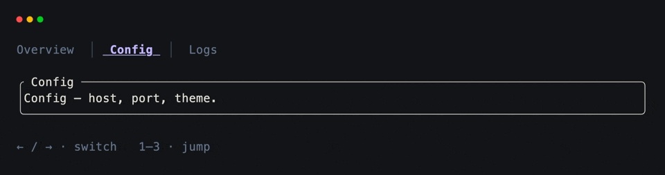
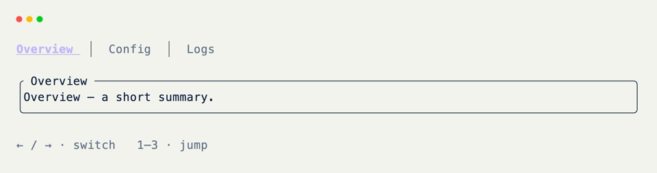

# Tabs

Store the active tab as an index. Change it with the keyboard. Rebuild the tab bar and body from that index before layout — usually in [grid_render]{data-preview}.

## Tab Index

```python title="Tab Index" hl_lines="9"
from xnano import BaseGrid, Field
from xnano.components.text import Text

TABS = ["Overview", "Config", "Logs"]

class TabApp(BaseGrid, direction="vertical", gap=1):
    tab_bar: Text = Field(default=Text(""), height=1)
    screen: str = Field(default="", border="rounded", title=" Screen ")

    selected_tab: int = Field(default=0, state=True) # (1)!
```

1. One state field owns which tab is live. Everything visible is derived from it.

## Switching Tabs

Hooks only change the index.

```python title="Switching Tabs" hl_lines="3 4 5 8 9 10"
from xnano import on_keyboard

@on_keyboard("left")
def prev_tab(self) -> None:
    self.selected_tab = (self.selected_tab - 1) % len(TABS)

@on_keyboard("right")
def next_tab(self) -> None:
    self.selected_tab = (self.selected_tab + 1) % len(TABS)

@on_keyboard("1")
def tab_one(self) -> None:
    self.selected_tab = 0
```

## Rebuilding the Screen

[grid_render]{data-preview} runs every frame before layout. Put derived paint here so handlers stay short.

```python title="Rebuilding the Screen" hl_lines="1 2 3 4 5 6 7 8 9"
def grid_render(self) -> None:
    bodies = {
        0: "Overview — a short summary of the active workspace.",
        1: "Config — host, port, and theme live here.",
        2: "Logs — [INFO] ready\n[DEBUG] tab render ok",
    }
    self.screen = bodies[self.selected_tab]
    self.grid_set_field("screen", title=f" {TABS[self.selected_tab]} ") # (1)!
```

1. Dynamic field props (title, border color) go through [grid_set_field]{data-preview} when you're not replacing the field's content.

## Styling the Tab Bar

```python title="Styling the Tab Bar" hl_lines="2 3 4 5 6 7 8 9 10 11"
def grid_render(self) -> None:
    parts: list[Text] = []
    for index, name in enumerate(TABS):
        if index == self.selected_tab:
            parts.append(
                Text(f" {name} ", color="violet-300", modifiers=("bold", "underline"))
            )
        else:
            parts.append(Text(f" {name} ", color="slate-500"))
        if index < len(TABS) - 1:
            parts.append(Text(" │ ", color="slate-600"))
    self.tab_bar = Text(parts)

    bodies = {
        0: "Overview — a short summary of the active workspace.",
        1: "Config — host, port, and theme live here.",
        2: "Logs — [INFO] ready\n[DEBUG] tab render ok",
    }
    self.screen = bodies[self.selected_tab]
    self.grid_set_field("screen", title=f" {TABS[self.selected_tab]} ")
```

## Putting It Together

```python title="Full Example"
from xnano import BaseGrid, Field, Terminal, Context, on_keyboard
from xnano.components.text import Text

TABS = ["Overview", "Config", "Logs"]

class TabApp(BaseGrid, direction="vertical", gap=1):
    tab_bar: Text = Field(default=Text(""), height=1)
    screen: str = Field(default="", border="rounded", title=" Screen ")
    hint: str = Field(
        default="← / → · switch   1–3 · jump   q · quit",
        height=1,
        color="slate-500",
    )

    selected_tab: int = Field(default=0, state=True)

    @on_keyboard("left")
    def prev_tab(self) -> None:
        self.selected_tab = (self.selected_tab - 1) % len(TABS)

    @on_keyboard("right")
    def next_tab(self) -> None:
        self.selected_tab = (self.selected_tab + 1) % len(TABS)

    @on_keyboard("1")
    def tab_one(self) -> None:
        self.selected_tab = 0

    @on_keyboard("2")
    def tab_two(self) -> None:
        self.selected_tab = 1

    @on_keyboard("3")
    def tab_three(self) -> None:
        self.selected_tab = 2

    def grid_render(self) -> None:
        parts: list[Text] = []
        for index, name in enumerate(TABS):
            if index == self.selected_tab:
                parts.append(
                    Text(
                        f" {name} ",
                        color="violet-300",
                        modifiers=("bold", "underline"),
                    )
                )
            else:
                parts.append(Text(f" {name} ", color="slate-500"))
            if index < len(TABS) - 1:
                parts.append(Text(" │ ", color="slate-600"))
        self.tab_bar = Text(parts)

        bodies = {
            0: "Overview — a short summary of the active workspace.",
            1: "Config — host, port, and theme live here.",
            2: "Logs — [INFO] ready\n[DEBUG] tab render ok",
        }
        self.screen = bodies[self.selected_tab]
        self.grid_set_field("screen", title=f" {TABS[self.selected_tab]} ")

    @on_keyboard("q")
    def quit(self, ctx: Context) -> None:
        ctx.terminal.request_exit()

Terminal().run(TabApp())
```

<div class="xnano-demo" markdown>
{.demo-dark}
{.demo-light}
</div>

<br/>

For heavier per-tab screens, assign nested grids or components to `screen` the same way — the index still picks which one. `examples/tabs_nav.py` builds different screen types per tab with accent colors that follow the selection.

[BaseGrid]: ../api/xnano/grid.md
[Field]: ../api/xnano/fields.md
[Terminal]: ../api/xnano/terminal/terminal.md
[Context]: ../api/xnano/context.md
[Text]: ../api/xnano/components/text.md
[grid_render]: ../api/xnano/grid.md#xnano.grid.BaseGrid.grid_render
[grid_set_field]: ../api/xnano/grid.md#xnano.grid.BaseGrid.grid_set_field
