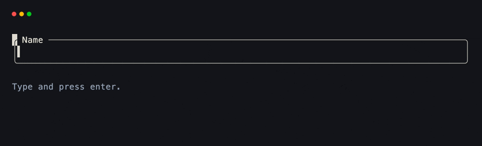
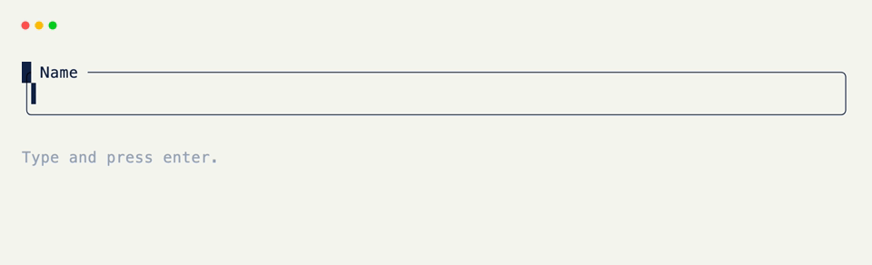

# Text Inputs

An editable field is a [Text]{data-preview} with `input=True` on a [Field]{data-preview}. Focus, tab order, and key routing are automatic.

## One Input

```python title="One Input" hl_lines="6"
from xnano import BaseGrid, Field, Terminal
from xnano.components.text import Text

class Form(BaseGrid, direction="vertical"):
    name: Text = Field(
        default_factory=lambda: Text("", input=True, placeholder="your name"), # (1)!
        height=1,
        border="rounded",
        title=" Name ",
    )

Terminal().run(Form())
```

1. `input=True` turns a leaf [Text]{data-preview} into a text box. `placeholder` shows while the field is empty and unfocused.

<div class="xnano-demo" markdown>
{.demo-dark}
{.demo-light}
</div>

<br/>

## Reading Content

After typing, the string is on `.content` — not the field attribute itself, which is still the [Text]{data-preview} instance. `.value` is the same plain string (and stays in sync for multi-line editors).

```python title="Reading Content" hl_lines="6 7"
from xnano import on_keyboard

@on_keyboard("enter")
def submit(self) -> None:
    name = self.name.content if isinstance(self.name.content, str) else ""
    self.result = f"Hello {name or '—'}"
```

## Multiple Inputs

Every `Text(input=True)` on a live grid joins one tab order. Tab cycles focus; no extra wiring.

```python title="Multiple Inputs" hl_lines="6 11"
from xnano import BaseGrid, Field
from xnano.components.text import Text

class Form(BaseGrid, direction="vertical", gap=1):
    name: Text = Field(
        default_factory=lambda: Text("", input=True, placeholder="your name"),
        height=1,
        border="rounded",
        title=" Name ",
    )
    email: Text = Field(
        default_factory=lambda: Text("", input=True, placeholder="you@example.com"),
        height=1,
        border="rounded",
        title=" Email ",
    )
    result: str = Field(default="Press enter to submit.", height=1, color="slate-400")
```

## Multi-line Editor

Add `multiline=True` (and optional `rows=N`) for a multi-line buffer with undo/redo and an in-buffer caret. Drop `height=1` so the field can grow to the editor.

```python title="Multi-line Editor" hl_lines="6"
from xnano import BaseGrid, Field
from xnano.components.text import Text

class Notes(BaseGrid, direction="vertical"):
    body: Text = Field(
        default_factory=lambda: Text(
            "", input=True, multiline=True, rows=5, placeholder="notes…"
        ), # (1)!
        border="rounded",
        title=" Notes ",
    )
```

1. `rows` is preferred visible height in lines; `None` sizes to content. Leave `multiline=False` (the default) for the lightweight single-line path.

## Submit on Enter

On single-line inputs, character keys stay on the focused field and enter is free for your handler. Multi-line editors insert a newline on enter — bind another key (or leave focus first) when you need a submit action.

```python title="Submit on Enter" hl_lines="3 4 5 6 7"
from xnano import on_keyboard

@on_keyboard("enter")
def submit(self) -> None:
    name = self.name.content if isinstance(self.name.content, str) else ""
    email = self.email.content if isinstance(self.email.content, str) else ""
    self.result = f"Hello {name or '—'} · {email or '—'}"
```

## Focus Styling

Optional: restyle a field when it gains or loses focus. Live focus is also on the component as `.focused` — useful inside other hooks without waiting for `@on_focus`.

```python title="Focus Styling" hl_lines="3 4 7 8"
from xnano import on_focus

@on_focus("name", kind="gained")
def highlight_name(self) -> None:
    self.grid_set_field("name", border_color="violet-400") # (1)!

@on_focus("name", kind="lost")
def clear_name(self) -> None:
    self.grid_set_field("name", border_color="slate-600")
```

1. [grid_set_field]{data-preview} updates layout props without replacing the `Text` (so typed content is kept). Read `self.name.focused` any time for the current flag.

<br/>

??? abstract "More on Text Inputs"

    - `placeholder` accepts a plain string (dim by default) or a styled [Text]{data-preview}.
    - `cursor` is the caret index into `content`; leave it `None` and it tracks the end as the user types.
    - Display modes (mutually exclusive with `input`): `ansi=True` for SGR sequences, `markdown=True` for markdown, `language="python"` for syntax highlighting only.
    - Full parameter list: the [Text]{data-preview} API reference. Focus kinds: [events & hooks]{data-preview}.

[Text]: ../api/xnano/components/text.md
[Field]: ../api/xnano/fields.md
[BaseGrid]: ../api/xnano/grid.md
[Terminal]: ../api/xnano/terminal/terminal.md
[events & hooks]: ../core-concepts/events.md
[grid_set_field]: ../api/xnano/grid.md#xnano.grid.BaseGrid.grid_set_field
